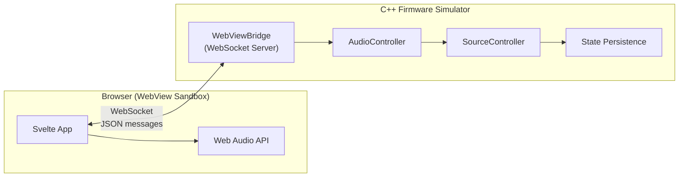

# Karaoke Demo — Hybrid Native/Web Audio Architecture

**[Live Demo](https://istudycs.github.io/Karaoke-Demo/)** — try it instantly, no install needed

> **Disclaimer:** This project is an independent technical demonstration of a hybrid native/web audio architecture. It is not affiliated with any company and contains no proprietary code. All architecture patterns shown are based on publicly available information.

A full-stack karaoke demo that simulates a **hybrid native + web** in-vehicle infotainment architecture:

- A **Svelte** webapp running inside a WebView sandbox handles audio playback, lyrics rendering, and the user-facing UI
- A **C++ firmware simulator** manages persistent state, the vocal/accompaniment slider, and communicates with the webapp over **WebSocket**
- The two layers exchange JSON messages in real-time, mirroring how a native Qt UI and a sandboxed web app coexist in a production system

## Architecture



**Message flow:**
- User moves the 9-position slider -> webapp sends `adjustVocalAndAccompanyVolume` -> firmware persists state, echoes `vocalAndAccompanyVolumeUpdated` -> webapp adjusts Web Audio gain nodes in real-time
- On connect, firmware sends `initialState` + `lyricsData` + current volume levels

## Quick Start (Docker)

```bash
git clone https://github.com/IstudyCS/karaoke-demo.git
cd karaoke-demo
docker compose up --build
```

Then open **http://localhost:5173** in your browser.

## Local Development

**Prerequisites:** CMake 3.20+, g++ (C++17), Node.js 20+

```bash
make setup         # Install frontend deps + build C++ backend
make dev           # Start both backend and frontend
```

- Frontend: http://localhost:5173
- Backend WebSocket: ws://localhost:9001

## Audio

The demo uses **"Winning" by NEFFEX**, a royalty-free track from the [YouTube Audio Library](https://studio.youtube.com/channel/audio) (no attribution required, free for any use). Vocal and instrumental tracks are included in the repository.

## Project Structure

```
karaoke-demo/
├── frontend/                  # Svelte + Vite + TypeScript
│   ├── src/
│   │   ├── App.svelte         # Main layout (car screen simulation)
│   │   ├── components/        # UI components (9 total)
│   │   │   ├── SlideSwitch    # 9-position vocal/accompaniment slider
│   │   │   ├── Lyrics         # 3-line synced lyrics display
│   │   │   ├── MessageLog     # Real-time WebSocket message inspector
│   │   │   └── ...
│   │   └── lib/
│   │       ├── protocol.ts      # Shared types (mirrors protocol.h)
│   │       ├── websocket.ts     # WebSocket + auto-fallback to mock
│   │       ├── mock-backend.ts  # In-browser firmware simulator
│   │       ├── audio.ts         # Web Audio API (dual-source mixing)
│   │       └── stores.ts        # Svelte stores (reactive state)
│   └── Dockerfile
├── backend/                   # C++ firmware simulator
│   ├── server.cpp             # WebSocket server + controller chain
│   ├── protocol.h             # Shared types (mirrors protocol.ts)
│   ├── sha1.h                 # Minimal SHA-1 for WS handshake
│   ├── CMakeLists.txt         # CMake build (auto-fetches nlohmann/json)
│   └── Dockerfile
├── docker-compose.yml         # 1-click run
├── Makefile                   # Local dev shortcuts
└── README.md
```

## Tech Stack

| Layer | Technology | Purpose |
|-------|-----------|---------|
| Frontend | Svelte 5, Vite, TypeScript | Reactive UI in WebView sandbox |
| Audio | Web Audio API | Dual-source mixing with real-time gain control |
| Transport | WebSocket (JSON) | Bidirectional IPC between webapp and firmware |
| Backend | C++17 | Firmware simulator with persistent state |
| Build | CMake + FetchContent | Zero-dependency C++ build |
| Deploy | Docker Compose | 1-click reproducible environment |
| Live Demo | GitHub Pages + Mock Backend | Zero-install interactive demo |

## Key Features Demonstrated

- **Hybrid Architecture:** Native C++ firmware + sandboxed web UI communicating over WebSocket
- **Real-time Audio Mixing:** Two independent audio sources (vocal + instrumental) with smooth gain transitions via Web Audio API
- **Protocol Synchronization:** Matching `protocol.h` (C++) and `protocol.ts` (TypeScript) — simulating IDL-generated bindings
- **State Persistence:** Firmware persists slider position and settings to disk, survives restarts
- **9-Position Slider:** Custom Qt-style slide switch with discrete positions and visual feedback
- **Graceful Degradation:** Runs as a static site on GitHub Pages with an in-browser mock backend when the C++ server is unavailable — slider, lyrics, and message log all work without any backend

## License

MIT
